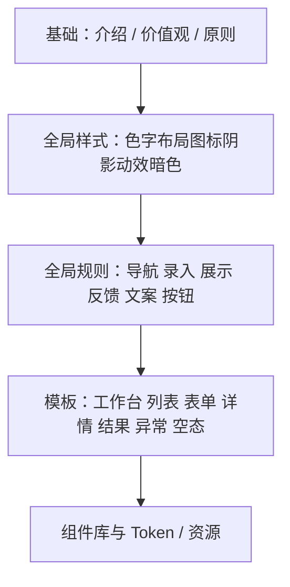

# 深势科技（DP Design）前端设计规范 · 完整目录与缺口清单

> 对照来源：  
> [Arco Design Spec](https://arco.design/docs/spec/introduce) · [Ant Design Spec](https://ant-design.antgroup.com/docs/spec/introduce-cn) · [DevUI Design](https://devui.design/design-cn/start) · [HiUI](https://xiaomi.github.io/hiui/components/overview/)  
> 视觉基准： [dp.tech](https://www.dp.tech/) · [bohrium.com](https://www.bohrium.com/)  
> 配套预览：`styleguide/index.html`

---

## 1. 完整规范体系（建议最终形态）

成熟设计体系通常分 **四层**：价值观 → 全局样式 → 全局规则/模式 → 模板与组件。深势前端指南建议对齐如下：



| 层级 | 模块 | 说明 | 现状 |
|------|------|------|------|
| **A. 基础** | 介绍 | 体系定位、适用产品、与官网关系 | 🟡 预览站已补骨架 |
| | 设计价值观 | 3–4 条品牌级价值观（如严谨 / 高效 / 可信 / 可生长） | 🔴 待撰写 |
| | 设计原则 | 亲密性、对齐、对比、反馈、减少跳转等 | 🔴 待撰写 |
| **B. 全局样式** | 色彩 | 品牌色、中性色、语义色、渐变边界 | 🟢 已有 |
| | 字体排版 | 字体栈、字号阶梯、字重、行高 | 🟢 已有 |
| | 布局与栅格 | 画板、8px 网格、24 栅格、侧栏宽度、断点 | 🟢 已锁定 2026-08-09 |
| | 间距 | Space scale、组件内外边距约定 | 🟢 已锁定（布局 §4.3） |
| | 圆角 / 边框 / 阴影 | Shape & elevation · 同心嵌套 | 🟢 已锁定 2026-08-10 |
| | 图标 | 线宽、尺寸阶梯、命名、使用场景 | 🟢 已锁定 2026-08-10 |
| | 暗黑模式 | Dark token 映射与适用范围 | 🟢 已锁定 2026-08-11 |
| | 动效 | 时长、缓动、场景（入场/反馈/过渡） | 🟢 已落地（建议默认，可调） |
| | 插画 / 空态插图 | 品牌插画语言（分子母题） | 🟡 暂不使用 · 空态改线型图标 |
| **C. 全局规则** | 导航 | 顶栏/侧栏/面包屑/步骤条/分页原则 | 🟡 预览骨架 |
| | 按钮 | 主/次/幽灵/危险/禁用层级 | 🟢 已锁定（组件样式 2026-08-11） |
| | 数据录入 | 表单布局、校验、帮助提示 | 🟢 基础已锁定（组件样式） |
| | 数据展示 | 表格、描述列表、卡片、统计数值 | 🟢 卡片/表基础已锁定 |
| | 数据格式 | 数字/日期/单位/精度展示规则 | 🟢 已锁定 2026-08-13 |
| | 反馈 | Toast / Modal / Drawer / Progress / Result | 🟢 已锁定 2026-08-11 |
| | 文案 | 语气、用词、空态文案、报错文案 | 🟢 已锁定 2026-08-14 |
| | 无障碍 / 国际化 | `zh` / `en`、Focus、aria-label、lang | 🟢 已锁定 · 验收 2026-08-14 |
| | 数据列表 | 筛选/排序/批量操作模式 | 🟢 已锁定 2026-08-13 |
| **D. 页面模板** | 工作台 Dashboard | KPI + 图表 + 列表 | 🟢 仪表盘示意 |
| | 列表页 | 筛选条 + 表格 + 分页 | 🟢 已锁定 2026-08-13 |
| | 表单页 | 单栏/双栏/分步 | 🟢 已锁定 2026-08-13 |
| | 详情页 | 页头 + 锚点 + 描述区 | 🟢 已锁定 2026-08-13 |
| | 结果页 | 成功/失败/进行中 | 🟢 已锁定 2026-08-13 |
| | 异常页 | 403/404/500 | 🟢 已锁定 2026-08-13 |
| | 空状态 | 无数据/无权限/搜索无结果 | 🟢 已锁定 2026-08-13 |
| | Showcase 落地页 | 对齐 dp.tech | 🟢 双场景页 |
| **E. 组件与工程** | 组件总览 | 按类别的组件清单与状态 | 🟡 预览清单 |
| | Design Token | CSS 变量、主题切换 | 🟢 已有 |
| | 设计资源 | Logo、图标包、Figma、Token 路径 | 🟢 已锁定 2026-08-14（Logo/Figma 占位） |
| | 贡献与治理 | SemVer、Changelog、准入、四站消费 | 🟢 已锁定 2026-08-14 §13 |

图例：🟢 已有可用内容 · 🟡 预览站已占位/部分完成 · 🔴 尚未设计

---

## 2. 相对你当前站点的缺口（优先补）

### P0 · 指南站「骨架必有」（本轮已补进预览站）

1. **介绍** — 说明 DP Design 是什么、服务哪些产品  
2. ~~**布局与栅格**~~ — ✅ 已锁定（8px / 24 栏 / Gutter 24 / 侧栏 220·72 / 顶栏 64）  
3. ~~**图标规范**~~ — ✅ 已锁定（线型 / 1.5 / 12·16·20·24·48–64 / 图标库 170，对齐 Ant·Arco 分类）  
3b. ~~**图形细节**~~ — ✅ 已锁定（圆角阶梯 · 同心嵌套 S9 · 边框 1px · 海拔 4 级 · Product 边框优先）  
4. ~~**暗黑模式**~~ — ✅ 已锁定（可选 Dark · token 重映射 · Product 优先 · 默认可选手动/系统）  
5. ~~**动效**~~ — ✅ 已落地（160/240/360 · emphasize · Product 克制 · reduced-motion）  
6. ~~**导航规则**~~ — ✅ 已锁定（Product 侧栏主导 · Showcase 顶栏 · 激活浅蓝底 · 面包屑/Tabs/Steps）  
7. ~~**反馈规则**~~ — ✅ 已锁定（分层 · Toast 3–5s · Modal 确认 / Drawer 详情）  
7b. ~~**组件样式**~~ — ✅ 已锁定（Button/Form/Tag/Card/Table/Switch）  
8. ~~**文案规则**~~ — ✅ 已锁定（严谨 · 正式 · 精准 · 简练 · §5.12）  
9. ~~**空状态 / 结果 / 异常**~~ — ✅ 已锁定（空态分型 · Result 三态 · 403/404/500）  
10. **组件总览清单** — 明确还要设计哪些组件  

### P1 · 内容需设计同学产出（预览站仅占位）

| 项目 | 产出物 |
|------|--------|
| 设计价值观（3–4 条） | 文案 + 一句话解释 + 正反例 |
| 设计原则 | 对齐 Ant「亲密性/对齐/对比…」选 5–7 条并本地化 |
| 图标库 | ✅ 统一线型包 170（Direction/Suggested/Editor/Data/Nav/Action/User/Comm/Time/App/Science） |
| ~~数据格式~~ | ✅ 单位 / 有效数字 / 千分位 / 时区（§5.11） |
| ~~列表/表单/详情模板~~ | ✅ 高保真页 + §5.9 / §5.10 |
| ~~插画系统~~ | 🟡 暂不使用（2026-08-14）；空态改用线型图标；旧 SVG 存档勿引用 |
| ~~无障碍 / 国际化~~ | ✅ 验收通过 · 两模式 `zh` / `en` + a11y 基线（§5.16） |
| ~~设计资源与版本治理~~ | ✅ 已锁定 · SemVer `0.1.2` + 跨工具 Agent Pack（介绍页下载）+ CHANGELOG（§13） |

### P2 · 组件库建设清单（对标 Ant/Arco/HiUI 常用集）

建议按批次建设，预览站「组件总览」中已列状态：

**通用**：Button、Icon、Typography、Space、Divider、Grid/Layout  
**导航**：Menu、Breadcrumb、Tabs、Steps、Pagination、Dropdown  
**数据录入**：Input、Select、Checkbox、Radio、Switch、DatePicker、Upload、Form、Slider  
**数据展示**：Table、List、Card、Statistic、Tag、Badge、Avatar、Tree、Descriptions、Empty  
**反馈**：Alert、Message/Toast、Modal、Drawer、Notification、Progress、Spin、Result、Skeleton  
**其他**：Tooltip、Popover、Affix、Anchor、BackTop  

| 批次 | 组件 | 状态 |
|------|------|------|
| **B1** | Upload · DatePicker · Descriptions · Statistic · Skeleton · Progress · Spin · Tooltip | ✅ 2026-08-14 §5.13 |
| **B2** | Notification · Avatar · Dropdown · Popover · Anchor | ✅ 2026-08-14 §5.14 |
| **B3** | Tree · Slider · Affix · BackTop | ✅ 2026-08-14 §5.15 |

---

## 3. 四站对照摘要

| 模块 | Ant Design | Arco | DevUI | HiUI | DP 预览站 |
|------|------------|------|-------|------|-----------|
| 价值观/原则 | ✅ | ✅ | ✅ | △ | 🟡 骨架 |
| 色彩/字体 | ✅ | ✅ | ✅ | △ | 🟢 |
| 布局/栅格/间距 | ✅ | ✅ | ✅ | △ | 🟡 |
| 图标/阴影/暗色 | ✅ | ✅ | △ | △ | 🟡 |
| 动效 | ✅ | △ | △ | △ | 🟡 |
| 导航/录入/展示/反馈 | ✅ | ✅ | ✅ | ✅ 组件向 | 🟡 |
| 文案/数据格式 | ✅ | △ | △ | △ | 🟢 |
| 页面模板 | ✅ | △ Pro | △ | △ | 🟢 列表表单详情+空态 |
| Token/主题 | ✅ | ✅ | ✅ | ✅ | 🟢 |

---

## 4. 建议建设节奏

| 阶段 | 目标 | 周期建议 |
|------|------|----------|
| **Phase 1** | 指南站 IA 齐全 + 全局样式定稿（色/字/布局/图标/动效/暗色） | 1–2 周 |
| **Phase 2** | 全局规则文案定稿（导航/录入/展示/反馈/文案）+ 空态/结果/异常模板 | 2–3 周 |
| **Phase 3** | 列表/表单/详情/工作台模板 + 核心组件视觉稿 | 3–4 周 |
| **Phase 4** | Token 工程化、四站落地、Figma 资源与治理 | 持续 |

---

## 5. 与预览站导航映射

| 侧栏分组 | 页面 |
|----------|------|
| 基础 | 介绍、价值观与原则 |
| 全局样式 | 色彩、字体、布局栅格、图形细节、图标、插画、暗色、动效 |
| 全局规则 | 导航、反馈、文案、无障碍/国际化、数据格式、组件样式 |
| 模板 | 页面模板（列表/表单/详情）、空态结果异常、Showcase/Product 双场景（仪表盘在基础区） |
| 组件与工程 | 组件总览清单、资源与治理、Token 调整 |

打开预览：

```bash
cd /pyg-vepfs/public/ypr/design-system/dp-bohrium/styleguide
python3 -m http.server 8765 --bind 0.0.0.0
```
