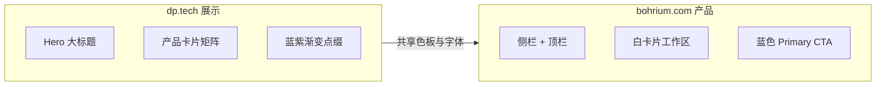

# DP Technology × Bohrium 前端设计规范

> **官方基准（已确认）**  
> - [深势科技官网](https://www.dp.tech/) — 品牌 / 展示站  
> - [玻尔 Bohrium](https://www.bohrium.com/) — 产品 / 工具站  
>  
> **文档状态：** 以官网为统一基准（2026-08-08）  
> **用途：** 小组工具前端视觉统一的唯一设计基准  
> **配套：**  
> - Token：[`../tokens/dp-bohrium.css`](../tokens/dp-bohrium.css)  
> - 可调预览页：[`../styleguide/index.html`](../styleguide/index.html)（TDesign 式指南站）  
> - **完整目录与缺口：** [`规范目录与缺口清单.md`](./规范目录与缺口清单.md)（对照 Ant / Arco / DevUI / HiUI）
> - **版本变更：** [`CHANGELOG.md`](./CHANGELOG.md)（当前 **v0.1.2**）

---

## 1. 设计定位

| 站点 | 角色 | 气质 |
|------|------|------|
| **dp.tech** | 品牌展示 | 科技感更强的营销首页：大 Hero、产品矩阵、蓝紫渐变点缀、展示型动效 |
| **bohrium.com** | 产品工作台 | 浅色科研 SaaS：清晰层级、蓝色行动色、Ant/自研组件体系、信息密度更高 |

**统一结论（可执行）：**

- **默认浅色**（白 / 冷灰底），不以深色为默认皮肤。  
- **主色为品牌蓝**（非青霓虹、非墨绿）：行动色约 `#3c49dd` / `#3b45e5`。  
- 展示站允许少量紫蓝辅助与渐变；工具站以中性灰阶 + 单一主蓝为主，克制装饰。  
- 字体以 **PingFang SC / MiSans** 体系为主，西文展示可用 Plus Jakarta / Merriweather / Roboto。



---

## 2. 色板规范

### 2.1 品牌与行动色（核心）

自 Bohrium 主题变量提取（与 dp.tech 高频色一致）：

| Token（建议名） | 色值 | 来源含义 | 用法 |
|-----------------|------|----------|------|
| `--dp-color-primary` | `#3b45e5` | `--color-primary` | 主品牌蓝 / 强调 |
| `--dp-color-action` | `#3c49dd` | `--color-dp-action` / 高频 CTA | 主按钮、链接、选中 |
| `--dp-color-primary-hover` | `#626aea` | `--color-primary-hover` | Hover |
| `--dp-color-primary-active` | `#2f37b7` | `--color-primary-active` | Active / Pressed |
| `--dp-color-primary-bg` | `#f7fafe` | `--color-primary-bg` | 浅蓝底 |
| `--dp-color-primary-bg-hover` | `#e9ebf7` | `--color-primary-bg-hover` | 浅蓝 Hover 底 |
| `--dp-color-action-bg-light` | `#e8f3ff` | `--color-dp-action-bg-light` | 轻行动底 / Tag |
| `--dp-color-action-bg-hover` | `#bedaff` | `--color-dp-action-bg-hover` | 轻行动 Hover |

**营销站补充色（dp.tech，仅 Showcase 慎用）：**

| 色值 | 出现场景 |
|------|----------|
| `#264aff` / `#3341ff` / `#5c65ff` | 亮蓝强调、渐变端点 |
| `#5d26ff` / `#6e25ff` / `#7843e7` | 紫蓝辅色（展示站装饰） |
| `#161a2e` / `#0c0f15` / `#020c1a` | 深色区块文字 / 深色 Hero 底 |

> 工具站（Bohrium 工作台）**不要**把紫蓝当主色大面积使用；主行动统一落到 `#3c49dd` / `#3b45e5`。

### 2.2 中性色（文本 / 填充 / 边框）

| Token | 色值 | 用途 |
|-------|------|------|
| `--dp-text-1` | `#1d2129` | 主文案（最高频） |
| `--dp-text-strong` | `#020c1a` | 更重标题（部分主题） |
| `--dp-text-2` | `#4e5969` | 次文案 |
| `--dp-text-3` | `#86909c` | 辅助说明 |
| `--dp-text-4` | `#c9cdd4` | 禁用 / 占位 |
| `--dp-text-secondary-alt` | `#353966` | 偏蓝灰次文（产品侧） |
| `--dp-text-tertiary-alt` | `#70749e` | 偏蓝灰三级文 |
| `--dp-fill-1` | `#f7f8fa` | 最浅填充 |
| `--dp-fill-2` | `#f2f3f5` | 浅填充 / 表头 |
| `--dp-fill-3` | `#e5e6eb` | 分割 / 禁用底 |
| `--dp-fill-4` | `#c9cdd4` | 深填充 |
| `--dp-bg-page` | `#f4f5f7` | 页面灰底 |
| `--dp-bg-layout` | `#f4f6fb` | 布局底（偏蓝灰） |
| `--dp-bg-white` | `#ffffff` | 卡片 / 面板 |
| `--dp-border` | `#e5e6eb` | 默认边框 |
| `--dp-border-light` | `#f2f3f5` | 轻边框 |
| `--dp-border-dark` | `#c9cdd4` | 强调边框 |
| `--dp-border-primary-tint` | `#e9ebf7` | 主题浅边 |

### 2.3 语义色

| Token | 色值 | 用途 |
|-------|------|------|
| `--dp-success` | `#0ab268`（辅 `#00b42a` / `#009a29`） | 成功 |
| `--dp-warning` | `#ff7d00` | 警告 |
| `--dp-warning-bg` | `#fff7e8` | 警告底 |
| `--dp-error` | `#ff4747` | 错误 / 危险 |
| `--dp-info` | `#3b45e5` | 信息（与主色同源） |

### 2.4 色彩使用规则

1. **一个页面只保留一个主行动色**（`#3c49dd` 或 `#3b45e5`，项目内二选一并写死）。  
2. 背景层级：`page 灰` → `白卡片` → `fill 浅底`；避免多层彩色面板。  
3. 链接 / 选中 / 主按钮同色相；次按钮用描边或灰底，不用第二高饱和色。  
4. 展示站渐变可用「蓝→紫蓝」，但面积控制在 Hero / 插画，不进表单控件。  
5. 图表：主序列用品牌蓝，其余用灰阶与语义色，忌彩虹线。

---

## 3. 字体规范

### 3.1 字体栈（按站点出现频率）

| 角色 | 推荐栈 | 依据 |
|------|--------|------|
| 中文 UI 正文 | `"PingFang SC", "MiSans", "Microsoft YaHei", sans-serif` | 两站最高频 |
| 中文品牌/界面可变字体 | `"MiSans VF", "MiSans", "PingFang SC", sans-serif` | dp / bohrium 均有 MiSans |
| 西文展示（营销） | `"Plus Jakarta Display", "PingFang SC", sans-serif` | dp.tech |
| 西文衬线强调（内容） | `"Merriweather", "Source Han Serif CN", serif` | bohrium 内容区 |
| 西文 UI | `"Roboto", "PingFang SC", sans-serif` | bohrium |
| 等宽 | `"JetBrains Mono", "Consolas", ui-monospace, monospace` | dp.tech |

### 3.2 字号与层级（落地建议）

| 层级 | 字号 | 字重 | 颜色 |
|------|------|------|------|
| Hero 标题（展示） | 40–56px / `clamp(2.5rem, 5vw, 3.5rem)` | 600–700 | `#1d2129` 或深色 Hero 上的白 |
| 页面标题 | 24–32px | 600 | `#1d2129` |
| 区块标题 | 18–20px | 600 | `#1d2129` |
| 正文 | 14–16px | 400 | `#1d2129` / `#4e5969` |
| 辅助 | 12–13px | 400 | `#86909c` |
| 标签 / Caption | 12px | 500 | `#86909c` 或主蓝 |

行高建议：标题 `1.2–1.3`，正文 `1.5–1.6`。

---

## 4. 圆角 · 间距 · 阴影 · 布局

### 4.1 图形细节（已锁定 2026-08-10）

> 决策：S1–S8 全部采纳建议默认值；**S9=A** 同心圆角。预览页：侧栏「图形细节」。

#### 4.1.1 圆角阶梯

| Token | 值 | 用途 |
|-------|-----|------|
| `--dp-radius-xs` | `2px` | Checkbox / 极小控件 |
| `--dp-radius-sm` | `4px` | 输入框、Tag、小按钮 |
| `--dp-radius` | `8px` | **控件默认**（按钮、Secondary、一般控件） |
| `--dp-radius-lg` | `12px` | 中层嵌套块、次级面板 |
| `--dp-radius-xl` | `16px` | 大卡 / Drawer / Modal（与 container 同值） |
| `--dp-radius-container` | `16px` | **Product 可见大容器默认**（页面主卡片 / 面板） |
| `--dp-radius-2xl` | `20px` | Showcase 大容器上限 |
| `--dp-radius-pill` | `100px` | 营销 CTA、少量 Chip（Showcase） |

**使用规则（S2-A）**  
- Product **主容器 / 白卡 / 面板**：默认 **16px**（`--dp-radius-container`），让页面可见最大块更柔和。  
- Product **按钮、输入、Tag 等控件**：仍用 **8 / 4**（`--dp-radius` / `sm`），避免控件也「泡」。  
- Showcase 大卡 **16–20px**；禁止全站统一超大 pill。  
- 嵌套仍按 §4.1.2：`子 = max(0, 父 − P)` 再下取阶梯（例：父 16 + P 8 → 子 8；父 16 + P 24 → 子 0）。

#### 4.1.2 嵌套圆角 · 同心规则（S9-A）

圆角容器内再套圆角容器时，内外弧应**同圆心**，保证圆角处缝宽与直边处内边距视觉等距。

**公式**

```text
子圆角 = max(0, 父圆角 − 该方向内边距 P)
```

多边 padding 不同时，按**实际贴边那一侧**的 P 计算；四边一致时用统一 P。

**落 Token**  
算出值后**就近下取**到现有阶梯（xs / sm / default / lg / xl），避免 3px、5px 等散值；差值 &lt; 2px 或 \(P \ge R\) 时，子级为 **0（直角）**。

| 父 R | P | 子 R（正确） | 错误示例 |
|------|---|--------------|----------|
| 16 | 8 | **8** | 子仍用 16 → 圆角处缝变窄 |
| 16 | 24 | **0** | 内层再写 8/16 → 挤缝 |
| 8 | 4 | **4** | 子用 8 → 显挤 |
| 8 | 8 | **0** | 内边距吃满圆角 |
| 12 | 4 | **8** | — |

**例外**  
- 子级为 **pill**（Chip / 开关）：不套用公式，保持 pill。  
- **图片 / 媒体裁切**：可不强制公式，优先裁切完整。  
- 仅 **1px 描边叠层**、无实质 padding：子圆角 ≈ 父 − 1，可忽略或仍用父级。

#### 4.1.3 边框（S3-A）

| 项 | 值 / Token |
|----|------------|
| 线宽 | **1px**（`--dp-border-width`）；强调靠颜色，不加粗 |
| Default | `#e5e6eb`（`--dp-border`） |
| Light | `#f2f3f5`（`--dp-border-light`） |
| Dark | `#c9cdd4`（`--dp-border-dark`） |
| Primary Tint | `#e9ebf7`（`--dp-border-primary-tint`） |
| Dashed | 仅上传区、占位虚框，**不作常规卡片边** |

#### 4.1.4 阴影 / 海拔（S4-A · S5-A）

| 级 | Token | 值 | 用途 |
|----|-------|-----|------|
| 0 | `--dp-shadow-none` | `none` | 默认表单控件、表格行 |
| XS | `--dp-shadow-xs` | `0 1px 2px #0000000a` | 细抬升 |
| Default | `--dp-shadow` | `0 4px 10px #9fbadc33` | 蓝味卡片 |
| Emphasis | `--dp-shadow-emphasis` | 蓝味 + 轻主色 | Hover / 焦点卡 |
| Modal | `--dp-shadow-modal` | Ant 式弹层阴影 | Modal / Dropdown / Popover |

**场景策略**

| 场景 | 规则 |
|------|------|
| **Product** | **边框优先**；默认卡片用边框，不用重阴影；Hover 可用 Tint 边或 XS 阴影 |
| **Showcase** | 可用 Default / Emphasis 蓝味阴影增强层次 |
| 禁止 | 重 glow、多层霓虹投影、大面积彩色阴影 |

#### 4.1.5 分割线（S6-A）

颜色 `--dp-divider`（同 Default 边框）；线宽 **1px**。用于表头/表尾、侧栏分组、卡片内区块；不用双线、不用阴影冒充分割。

#### 4.1.6 Focus 环（S7-A）

边框切 Action；外环 `--dp-focus-ring`（`0 0 0 3px` + Action 16% 透明）。**禁止粗霓虹 ring**。

#### 4.1.7 间距归属（S8-A）

Space scale 以 **§4.3 / 布局** 为准；本页只展示对照，不另定组件专用间距表。

### 4.3 间距（8px 网格 · 已锁定）

| Token | 值 |
|-------|-----|
| `--dp-space-1` … `--dp-space-16` | 4 / 8 / 12 / 16 / 20 / 24 / 32 / 40 / 48 / 64px |
| `--dp-page-padding` | 24px（窄屏可用 `--dp-page-padding-sm: 16px`） |
| `--dp-card-padding-tool` | 16–24px |
| `--dp-card-padding-showcase` | 24–40px |

### 4.4 布局与栅格（已锁定 2026-08-09）

> 决策：全部采纳建议默认值。预览页：侧栏「布局与栅格」。

| 项 | 锁定值 | Token |
|----|--------|-------|
| 网格基数 | 8px | `--dp-grid-base` |
| 内容栅格 | 24 栏 | `--dp-grid-columns` |
| Gutter | **固定 24px**（Column 随宽变） | `--dp-grid-gutter` |
| 顶栏高度 | 64px | `--dp-header-height` |
| 侧栏展开 / 折叠 | 220px / 72px | `--dp-sidebar-width` / `--dp-sidebar-collapsed` |
| Product 内容最大宽 | 1200px | `--dp-container-max` |
| Showcase 内容最大宽 | 1280px | `--dp-container-wide-max` |
| 页面左右边距 | 24px | `--dp-page-padding` |

**布局模式**

| 模式 | 适用 | 结构 |
|------|------|------|
| **T 型（Product 默认）** | Bohrium / fermopt / 报价内页 / Macroflow 壳层 | 顶栏 64 + 侧栏 220 + 内容画布 |
| **上下（Showcase）** | dp.tech / SynAsterHub / 报价首页 | 顶栏 + 通栏内容（最大 1280） |
| 左右（无顶栏） | 仅特殊全屏工具 | 侧栏 + 内容（非默认） |

**背景层级（L6-A）**  
画布 `--dp-bg-layout` → 白卡片 `--dp-bg-white`；顶栏/侧栏白底 + `--dp-border` 分割。

**断点**

| 名称 | 宽度 | 行为 |
|------|------|------|
| xs | &lt; 768 | 侧栏抽屉化 |
| md | ≥ 768 | 可折叠侧栏 |
| lg | ≥ 1200 | 标准工作台 |
| xl | ≥ 1600 | 宽屏多栏（可选） |

**规则摘要**

1. 间距、尺寸优先落在 8px 网格上。  
2. 内容区用 24 栅格排布多列；Gutter 保持 24px 定值。  
3. Product 不随意加第三侧栏；需要时用 Drawer。  
4. 窄屏优先保证内容可读，侧栏收起而非挤压内容区。

### 4.5 图标（已锁定 2026-08-10）

> 决策：全部采纳建议默认值。预览页：侧栏「图标」。

**风格**  
线型（outlined）为主；面型仅用于选中/强调的少量场景。设计视口统一 **16×16**，端点与转角略圆。

**尺寸**

| 用途 | 尺寸 | Token |
|------|------|-------|
| 辅助 | 12px | `--dp-icon-size-xs` |
| 默认 | 16px | `--dp-icon-size-sm` |
| 导航 / 列表 | 20px | `--dp-icon-size-md` |
| 强调 | 24px | `--dp-icon-size-lg` |
| 空态 / 结果 | 48–64px | `--dp-icon-size-xl` / `--dp-icon-size-2xl` |

**线宽**  
@16px 视觉线宽约 **1.5**（`--dp-icon-stroke`）。同一界面线宽保持一致。

**用色**

| 状态 | 色 |
|------|-----|
| 默认 | Text 2 / Text 3（`--dp-icon-color` / `--dp-icon-color-muted`） |
| 激活 / 选中 | Action `#3c49dd`（`--dp-icon-color-active`） |
| 禁用 | Text 4（`--dp-icon-color-disabled`） |
| 语义色 | 仅成功/警告/错误状态，不作品牌装饰 |

**与文字**  
垂直居中；图标与文字间距 **8px**（`--dp-icon-gap`）。

**命名**  
`dp-icon-{category}-{name}`，如 `dp-icon-action-search`。组件 API 建议：`size` / `color` / `spin`。

**图标库规模（对齐 Ant Design Icons / Arco Icon 分类规格）**

当前预览库 **170** 个线型图标（`styleguide/icons-sprite.svg` + `icons-registry.json`），按类别：

| 类别 | 数量 | 说明 |
|------|------|------|
| Directional 方向 | 26 | 箭头、折叠、全屏、换位等 |
| Suggested 提示/状态 | 21 | success / warning / error / info / loading 等 |
| Editor 编辑 | 19 | 编辑、对齐、列表、字号等 |
| Data 数据 | 23 | 文件、文件夹、表、图、云、代码等 |
| Navigation 导航 | 10 | home、dashboard、docs、settings 等 |
| Action 操作 | 41 | 增删改查、导入导出、锁定、缩放等 |
| User 用户 | 3 | user / team |
| Communication 通讯 | 6 | 铃铛、邮件、消息等 |
| Time 时间 | 3 | 日历、历史、排期 |
| Application 应用 | 11 | 定位、设备、环境等 |
| Science 科学 | 7 | molecule、atom、flask、experiment、compute、lab、dna |

命名：`dp-icon-{category}-{name}`，如 `dp-icon-action-search`、`dp-icon-science-molecule`。

**资源策略**  
统一使用本库 SVG sprite / 图标组件；禁止各项目私自混用多套风格。后续可按业务再扩展，但须保持线型、线宽与命名约定。

### 4.6 暗黑模式（已锁定 2026-08-11）

> 决策：D1–D10 全部采纳建议默认值。预览页：侧栏「暗黑模式」。

**定位**  
默认 **Light**；Dark 为**可选主题**，通过 `data-dp-theme="dark"` **重映射 CSS 变量**实现，禁止整页 `filter: invert`。

**适用范围（D2-A）**  
Product 工具站优先提供切换（工作台 / fermopt / 报价内页 / Macroflow 壳层）。Showcase 落地页默认 Light，可保留局部深色 Hero（`--dp-bg-hero-dark`）；Hero 深色区块 ≠ 完整 Dark 主题。

**切换（D4-A）**  
手动切换为主；默认**不跟随**系统。可选第三态 `system`（跟随 `prefers-color-scheme`）。持久化：`localStorage['dp-theme']` = `light` \| `dark` \| `system`。

**表面 / 文本映射**

| Token | Light | Dark |
|-------|-------|------|
| `--dp-bg-page` | `#f4f5f7` | `#0c0f15` |
| `--dp-bg-layout` | `#f4f6fb` | `#12162a` |
| `--dp-bg-white` | `#ffffff` | `#1a1f36` |
| `--dp-bg-header` | 白卡 92% 透明 | 深色卡 92% 透明 |
| `--dp-fill-1/2/3` | 浅灰阶 | `#1e243c` / `#262d48` / `#323a58` |
| `--dp-border` | `#e5e6eb` | `#2e3554` |
| `--dp-text-1…4` | 深灰阶 | `#f2f3f5` → `#5c637a` |

**壳层必须跟主题（稳定性硬性要求）**

1. **顶栏 / 侧栏 / 内容画布** 背景、边框、文字必须使用 token（`--dp-bg-header` / `--dp-bg-white` / `--dp-bg-layout` / `--dp-border` / `--dp-text-*`）。  
2. **禁止**在壳层写死 `#fff`、`rgba(255,255,255,*)`、`background: white`；否则 Dark 下会出现「内容已变深、顶栏仍发白」。  
3. `color-mix(..., white)` 类写法须改为 `color-mix(..., var(--dp-bg-white))`。  
4. 主题切换时清除内联 `--dp-*` 覆盖，保证效果可重复、可回切。  
5. 局部深色 Hero（`--dp-bg-hero-dark`）可固定深色，**不得**反向把壳层锁成浅色。

**品牌与语义（D6-A）**  
Dark 下实心 Action / Primary 填充为 `#6b74f2`（Hover `#858df5`），字 **白** `--dp-text-on-primary`；深色底上的选中字/线型图标用 `--dp-icon-color-active`（`#d2d6ff`）提亮。浅底徽章上的字/图标用近白，避免深蓝叠深蓝。Product Dark 仍克制营销紫蓝。

**阴影（D7-A）**  
改为更深中性阴影（如 `0 4px 16px #00000066`）；Product 仍边框优先；按钮 Hover 发光环用更亮 Action 约 28% 透明。

**图表 / 代码 / 插画（D8-A）**  
图表网格用 Dark 边框色；代码块深底浅字；插画优先 Dark 适配版；图标继续 `currentColor`。

**无障碍（D10-A）**  
正文目标 WCAG AA；切换不闪白（含顶栏），色变 transition ≤ 240ms。

---

## 5. 组件规范

### 5.0 组件样式（已锁定 2026-08-11 · B1/B2 扩展 2026-08-14）

> 决策：C1–C9 全部采纳建议默认值。预览页：侧栏「组件样式」。  
> 引用色板 / 圆角 / Focus / 动效 / 反馈，不另开冲突值。Alert 以 §5.5 为准。  
> **B1：** Upload、DatePicker、Descriptions、Statistic、Skeleton、Progress、Spin、Tooltip——§5.13。  
> **B2：** Notification、Avatar、Dropdown、Popover、Anchor——§5.14。  
> **B3：** Tree、Slider、Affix、BackTop——§5.15。

**已覆盖：** 基础组件 + §5.13–5.15（B1–B3）。  
**后续：** 业务特化组件按项目增量补充。

### 5.1 按钮

| 类型 | 样式 |
|------|------|
| Primary | 背景 Action，字白；Hover 提亮 + 外发光；Active 加深；禁位移 |
| Secondary | 白底 + 边框；Hover 浅蓝底 + Action 边/字 + 外环 |
| Ghost | 透明底 + 边框；Hover 内发光 |
| Text / Link | 字 Action；无底 |
| Danger | 背景/边框 Error；确认仍走 Modal |
| Disabled | 字 Text 4，底 fill-2；无发光 |

| 项 | 值 |
|----|-----|
| 高度 | Product 32 / **36**；营销 CTA 40–48（`btn--lg`） |
| 圆角 | Product 控件 8；容器 16；Showcase CTA 可 pill |
| 图标按钮 | 36×36，图标 16；与文字间距 8 |
| 工具类图标钮 | 主题 / 下载 / 刷新等**优先图标**（见下），须 `aria-label` / `title`；**禁止**单字「深」「浅」代替昼夜 |

**工具图标映射（有则必用）：**

| 动作 | 图标 id |
|------|---------|
| 切到深色（当前浅色时显示） | `time-moon` |
| 切到浅色（当前深色时显示） | `time-sun` |
| 下载 | `action-download` |
| 上传 | `action-upload` |

#### 5.1.1 填充底上的字色（对比度硬规则）

| 底 | 字 / 字母色 |
|----|-------------|
| Primary / Action **实心填充**（含 Avatar 色块、Logo 色块） | **必须** `--dp-text-on-primary`（浅色）；禁止 Text 1 / 黑字 |
| Action **浅底**（`--dp-color-action-bg-light`） | Action 字色 |
| 白底 / 灰底控件 | Text 1 / Text 2 |

注意：若全局写了 `color: … !important`，实心填充上的字须用同级 `!important` 或专用类（如 `.mf-on-primary`）压过继承，否则易出现「深蓝底 + 黑字母」。

### 5.2 输入与表单

| 项 | 值 |
|----|-----|
| 高度 | 默认 36；紧凑 32 |
| 圆角 | 4px（`--dp-radius-sm`） |
| 边框 / 底 | 1px `--dp-border` / 白卡 |
| Focus | Action 边 + `--dp-focus-ring` |
| 错误 | 边框与提示 `--dp-error`；说明 12px |
| 标签 | 14px Text 2；必填红 `*` |
| 布局 | 默认标签在上；密集表可左标签宽 120 |
| Select | **自定义下拉**：展开与触发框拼成一体（下圆角收起、共边、无浮层阴影）；不用系统原生弹出窗。选中项用 Action 浅底，不用反白整行 |

### 5.3 卡片 / 面板

| 场景 | 规则 |
|------|------|
| Product | 白底 + 1px 边框；圆角 **16**（`--dp-radius-container`）；默认无重阴影 |
| Showcase | 可用蓝味阴影；大卡 16–20 |
| Hover | Product：Tint 边或 XS；Showcase：可 Emphasis |
| 内边距 | Tool 16–24；Showcase 24–40 |
| 嵌套 | 同心圆角（§4.1.2） |

### 5.3a Tag / Badge / 选择器 / 表格

**Tag：** 高 22–24，圆角 4；类型 blue / gray / success / warning / error。禁当主按钮、禁成功绿做导航装饰。  
**Badge：** 红点或数字；超过 99 显示 `99+`。  
**Checkbox / Radio：** 16px，选中 Action，与文字间距 8。  
**Switch：** 高 22 / 宽 40；开=Action，关=fill-3。  
**Table：** 表头 fill-2 + Text 2 半粗；行高 48–56（紧凑 40）；默认无竖线；行 Hover fill-1；选中行 Action 浅底；操作列右对齐用 Link。

**正反例：** 一页一个 Primary · 错误红字在控件下 · 表格操作列用 Link · Product 卡片靠边框。  
反例：一排多个实心主按钮 · 只红边无说明 · 每行三个 Primary · 工具台满屏重阴影卡。

### 5.4 导航与站点页脚（已锁定 2026-08-11 · 细节补全 2026-08-16）

> 决策：N1–N8 全部采纳建议默认值；2026-08-16 补全顶栏/侧栏尺寸表与**站点页脚**。预览页：侧栏「导航」。  
> 壳层尺寸：顶栏 64 · 侧栏 220/72。

#### 5.4.1 默认模式

| 场景 | 模式 |
|------|------|
| **Product** | 侧栏主导航 + 顶栏工具区（搜索 / 通知 / 主题 / 用户）；内容区可加面包屑 |
| **Showcase** | 顶栏一级导航（Logo + 菜单 + CTA）；无侧栏 |
| 禁止 | 侧栏一级与顶栏一级双套并存 |

#### 5.4.2 侧栏

| 项 | 规则 |
|----|------|
| 宽 | 展开 **220px** / 折叠 **72px**（`--dp-sidebar-width` / `--dp-sidebar-collapsed`） |
| 背景 / 边 | 白底 `--dp-bg-white`；右侧 1px `--dp-border` |
| 顶区品牌 | Logo 图形高 **28px**；产品名 **14–16px · 600 · Text 1**；Logo↔名间距 **8px**；区内边距 **16–20px** |
| 分组 | 小标题分组（12px · 500 · Text 3）；组间轻量分隔 |
| 层级 | 默认 ≤ **2 级**；更深用页内锚点 / Tabs |
| 菜单项高 | **40px**；左右 padding **16px**（折叠态水平居中） |
| 图标 | 一级 **20px** 线型；与文案间距 **10px**；折叠态仅图标 + Tooltip |
| 字 | 默认 **14px · 400 · Text 2**；Hover：底 `--dp-fill-1` + Text 1；激活：底 `--dp-color-action-bg-light` + Action · **500/600**；**无左侧竖条** |
| 当前页 | `aria-current="page"` |

#### 5.4.3 顶栏

| 区域 | Product | Showcase |
|------|---------|----------|
| 左 | 折叠 + 面包屑（或页标题） | Logo + 一级菜单 |
| 中 | 可选全局搜索 | — |
| 右 | 主题 · 通知 · 用户 | 登录 / 主 CTA |

**壳层尺寸**

| 项 | 值 |
|----|-----|
| 高度 | **64px**（`--dp-header-height`） |
| 背景 | `--dp-bg-header`（须跟主题，禁写死白） |
| 底边 | 1px `--dp-border` |
| 水平内边距 | **24px**（窄屏 **16px**，同页边） |

**Logo 区（Showcase 顶栏左 / Product 侧栏顶）**

| 项 | 值 |
|----|-----|
| 图形高度 | **28–32px**（推荐 28） |
| 产品名 | **16px · 600 · Text 1**（侧栏可用 14–16） |
| Logo↔名 | **8px** |
| 与内容起点 | 贴齐水平 padding 内缘，不额外缩进 |

**Showcase 一级菜单**

| 项 | 值 |
|----|-----|
| 字 | **14px · 500 · Text 1** |
| 热区 | 项高贴齐顶栏，可点高度 ≥ **40px**；水平 padding **12px** |
| Hover | Text 1 + 底 `--dp-fill-1`，或 Action 字色；无位移 |
| 激活 | Action 字色；**无下划线粗条**、无左侧竖条 |
| 与 Logo 间距 | 菜单组距 Logo 区 ≥ **24px** |

**Product 顶栏左**

| 项 | 值 |
|----|-----|
| 折叠钮 | **32×32** 图标钮（Ghost / 无框均可，热区清晰） |
| 面包屑 | 中间级 **14px · Text 2**；末级 **14px · 600 · Text 1**；分隔 Text 3 |

**顶栏控件层级（右区 / 工具）**

| 项 | 规则 |
|----|------|
| **功能入口 / 打开面板**（会话、智能体、对话、工作流等） | **菜单样式**：图标 + 文案，**无边框、无填充盒**；**14px · 600 · Text 1**；Hover/激活 Action 字色 |
| **模式类开关**（浅色/深色主题等） | **按钮样式**：保留 Secondary 边框盒（仅图标亦可）；**32×32**；用 `time-sun` / `time-moon`；须 `aria-label`；**禁止**「深/浅」单字 |
| 通知 / 下载等图标钮 | **32×32**；间距 **8px** |
| 用户 Avatar | **28–32px**；见 §5.14；实心 Action 底必须 on-primary 浅色字 |
| Showcase 主 CTA | 顶栏右侧 **一个** Primary（高 32–36）；登录用 Secondary / Link |

图标实现注意：业务站内联 SVG 须用稳定 path（可用指南站 `time-sun` / `time-moon` 几何）；复杂 path 若渲染异常应简化，属**实现问题**而非「可以省略图标」。

#### 5.4.4 面包屑

- 信息架构 ≥ 3 层，或列表 → 详情时使用。  
- 中间可点，**末级不可点**、Text 1 加粗；分隔 `/` 或 `>`，色 Text 3。  
- 顶栏已有面包屑时，页头 h1 只保留页面名，不重复整条路径。

#### 5.4.5 Tabs / Steps / 分页 / 锚点

| 组件 | 用法 |
|------|------|
| Tabs | 同一对象下的并列视图；**不作**站级主导航 |
| Steps | 线性向导，建议 3–5 步 |
| Pagination | 列表翻页；页大小常用 10/20，显示总数 |
| 锚点 | 长详情章节跳转；与侧栏二级互补 |

#### 5.4.6 响应式

| 断点 | 行为 |
|------|------|
| &lt; 768 | 侧栏抽屉；顶栏保留汉堡；页脚链接改单列或折叠分组 |
| ≥ 768 | 侧栏可折叠 220 ↔ 72 |
| Showcase 窄屏 | 顶栏菜单收为抽屉 / 折叠 |

#### 5.4.7 站点页脚（Site Footer）

> 指落地页 / 门户底部的**站点页脚**，不是表单粘性操作底栏。

| 项 | 规则 |
|----|------|
| 适用 | **Showcase / 落地页** 为主 |
| Product | 控制台默认**无页脚**；若需合规，仅极简版权一行（12–13 · Text 3），不放链接矩阵 |
| 结构 | 上：链接分组（如产品 / 资源 / 关于）；下：版权 + 可选备案 / 社交图标 |
| 背景 | `--dp-bg-white` 或 `--dp-fill-1`；顶部 **1px** `--dp-border` |
| 内容宽 | 对齐 Showcase 容器 ≤ **1280**；水平 padding **24**（窄屏 16） |
| 主链接区 | 上下 padding **40–48**；分组多列，列间距 ≥ 24 |
| 版权条 | 上下 padding **16–20**；可与主区同底或轻分割 |
| 分组标题 | **13–14px · 600 · Text 1** |
| 链接 | **13–14px · 400 · Text 2**；Hover **Action**；项间距 **8–12** |
| 版权文案 | **12–13px · Text 3**；可折行 |
| 社交图标 | 20px 线型；间距 12；默认 Text 2，Hover Action |
| 禁止 | 页脚放 Primary 实心大按钮抢主 CTA；用成功绿 / 警告橙做装饰；页脚再套一层重阴影大卡 |

#### 5.4.8 正反例

| ✅ | ❌ |
|----|----|
| 一组主导航讲清「能去哪」 | 顶栏 + 侧栏 + Tabs 三套一级抢戏 |
| 顶栏 64 · Logo 28–32 · 菜单 14px | 顶栏过高/过矮，Logo 与菜单字号混乱 |
| 顶栏功能入口无框；模式开关保留边框 | 功能入口做成带边框按钮盒 / 主题钮抹掉边框 |
| Showcase 用分区页脚；Product 无页脚或单行版权 | 控制台塞满页脚链接矩阵 |
| 页脚链接 Text 2 → Hover Action | 页脚 Primary 大按钮、霓虹装饰 |
| 详情用面包屑回列表 | 只靠浏览器后退 |
| 流程用 Steps | 用侧栏假装步骤 |
| 主题切换用日月图标 | 「深」「浅」单字按钮 |

### 5.5 反馈（已锁定 2026-08-11）

> 决策：F1–F9 全部采纳建议默认值。预览页：侧栏「反馈」。  
> 动效沿用 §6：Toast / Drawer / Modal ≈ **240ms** emphasize。

**原则：** 能轻则轻，能不打断就不打断。

#### 5.5.1 分层

| 类型 | 打断 | 场景 |
|------|------|------|
| Message / Toast | 低 | 保存/复制成功、轻量失败 |
| Notification | 中 | 异步长任务完成/失败（可带操作） |
| Alert / Banner | 中 | 页内持续提示（权限、草稿、只读） |
| Drawer | 中高 | 详情/轻编辑，保持列表上下文 |
| Modal | 高 | 删除/不可逆确认、阻断式表单 |
| Progress / Spin | — | 进行中 |
| Result | — | 流程结束页（版式见模板页） |
| Skeleton | — | 模块加载占位 |

#### 5.5.2 Toast / Message

- 位置：顶部居中；Notification 可用右上，**勿与 Toast 共用同一槽位**。  
- 时长：成功 3s；信息/警告 4–5s；错误 5s 或手动关。  
- 同屏最多 1–3 条；禁止用 Toast 做删除确认或连环刷屏。

#### 5.5.3 Modal vs Drawer

| 场景 | 选用 |
|------|------|
| 不可逆 / 需明确同意 | **Modal**（确认类默认点击遮罩不关闭） |
| 详情、侧滑编辑、筛选 | **Drawer**（右侧，宽约 400–720；遮罩可关） |
| Esc | 均支持关闭；未保存二次提示为 P1 |

#### 5.5.4 Alert / 加载

- Alert：info / success / warning / error；放内容区顶部（标题下）；持续状态用 Banner，瞬时结果用 Toast。  
- 按钮提交：内嵌 Spin + disable；区域刷新用区域 Spin/Skeleton；&lt;300ms 可不转圈。

#### 5.5.5 文案与正反例

语气与句式见 **§5.12**。危险操作按钮写清动作（如「删除任务」）。

| ✅ | ❌ |
|----|----|
| 保存成功 → Toast | 保存成功 → Modal |
| 删除 → Modal 确认 | 删除仅 Toast、无确认 |
| 行详情 → Drawer | 每行整页跳转且无面包屑 |
| 页顶草稿 Banner | 同一信息反复 Toast |

Result / 空态版式细则见 **§5.8**。

### 5.6 标签 · 状态 · 空态

- Tag：浅底（`#e8f3ff` / `#f2f3f5`）+ 对应色文字，圆角 4px。  
- Success / Warning / Error 严格用语义色，不与主蓝混用。  
- 空态版式详见 **§5.8**（图标 48–64 + 说明 + 一个主按钮）。

### 5.7 图标与插画（插画暂不使用 · 2026-08-14）

> **现行：** 空态 / Result / Guide **使用线型大图标（48–64）**，见 §4.5 与预览站「图标」。  
> **插画：** 现有 SVG 观感未达发布标准，**暂不作为交付与改站素材**；预览站「插画」页仅保留策略说明与预留约定。仓库 `illustrations/` 内文件为存档，业务站勿引用。  
> 正式插画到位后，再恢复启用（命名仍建议 `dp-illust-{scene}-{name}.svg`）。

#### 5.7.1 图标（摘要 · 现行主视觉）

工具壳层 / 导航 / 表内操作 / **空态主图**：单色灰或主蓝线型图标。空态推荐映射：

| 场景 | 图标 id（示例） |
|------|-----------------|
| 无数据 | `data-inbox` |
| 无结果 | `action-search` |
| 无权限 | `action-lock` |
| 加载失败 | `status-exclamation-circle` |

#### 5.7.2 插画预留（未启用）

| 项 | 预留约定 |
|----|----------|
| 母题 | 分子 / 键连几何（正式稿确认前不落地） |
| 命名 | `dp-illust-{scene}-{name}.svg` |
| 尺寸 | sm 96 · md 160 · lg 240 · hero ≤ 480 |
| 禁止 | 写实结构式、吉祥物、贴纸风、强霓虹、3D 拟物；插画当侧栏图标 |

#### 5.7.3 正反例（现行）

| ✅ | ❌ |
|----|----|
| 空态线型图标 48–64 + 一句引导 + 一主按钮 | 引用当前存档插画 SVG 作线上素材 |
| Result 用语义色状态图标 | 空态同时放多张装饰图 |

### 5.8 空态 / 结果 / 异常（已锁定 2026-08-13）

> 决策：E1–E8 全部采纳建议默认值。预览页：侧栏「空态 / 结果 / 异常」。  
> 列表/表单/详情见 §5.9；数据列表模式见 §5.10；数据格式见 §5.11。  
> **视觉现行：线型大图标 48–64**（§5.7）；插画素材暂不使用。

#### 5.8.1 通用版式

结构：**图标 → 标题 → 说明（1–2 句）→ 主操作（+ 可选次操作）**。  
内容区或卡片内居中。图标 48–64；标题 Text 1；说明 Text 3（原因 + 下一步）；**一个** Primary。  
禁止：夸张循环动画、纯「暂无数据」无引导、一排多个 Primary、引用未启用的插画存档。

#### 5.8.2 空状态

| 类型 | 标题示例 | 主操作 |
|------|----------|--------|
| 无数据 | 还没有内容 | 新建 / 开始… |
| 搜索无结果 | 未找到匹配项 | 清空筛选 |
| 无权限 | 暂无访问权限 | 申请权限 / 返回 |
| 加载失败（区级） | 加载失败 | 重新加载 |

区级空态放在卡片/表格内；全页空态用于模块首次进入。

#### 5.8.3 结果页（Result）

| 状态 | 色 | 操作示例 |
|------|-----|----------|
| 成功 | Success | 查看结果 · 返回列表 |
| 失败 | Error | 重试 · 返回修改 |
| 进行中 | Action | 查看进度 · 后台运行 |

用于流程终点；**保存成功仍用 Toast**（§5.5）。可选摘要字段，避免大段日志。

#### 5.8.4 异常页

| 码 | 标题 | 主操作 |
|----|------|--------|
| 404 | 页面不存在 | 返回首页 |
| 403 | 无权访问 | 返回 / 申请权限 |
| 500 | 服务异常 | 重试 / 返回首页 |

可保留壳层（顶栏/侧栏）。技术细节默认折叠，「查看详情」展开（Product）。

#### 5.8.5 边界与正反例

| 场景 | 用 |
|------|-----|
| 保存成功 | Toast |
| 列表无行 | 空态 |
| 向导结束 | Result |
| 路由不存在 | 404 |

| ✅ | ❌ |
|----|----|
| 说明如何开始 + 按钮 | 只写「暂无数据」 |
| 404 提供返回首页 | 空白无操作 |
| 成功 Result + 查看结果 | 成功再弹「太棒了」Modal |

### 5.9 页面模板（已锁定 2026-08-13 · 验收通过）

> 决策：列表 / 表单 / 详情全部采纳建议默认值；验收「页面模板通过」。预览页：侧栏「页面模板」。  
> 空态 / Result / 异常见 §5.8；筛选·排序·批量细则见 §5.10。

#### 5.9.1 列表页

| 项 | 规则 |
|----|------|
| 壳层 | Product T 型（顶栏 64 + 侧栏 220/72） |
| 顶区 | 面包屑（列表→详情链）+ 页头：左标题/说明，右 **一个** Primary（如「新建」） |
| 结构 | 页头 → 筛选区 → 表格 → 底部分页 |
| 行交互 | 轻详情默认 **Drawer**；重编辑 / 多区块进 **详情页** |
| 分页 | 右下；页大小 **10 / 20**（默认 **20**）；显示总数 |
| 空态 | 复用 §5.8（无数据 / 无结果 / 失败） |

#### 5.9.2 表单页

| 项 | 规则 |
|----|------|
| 默认布局 | 单栏；标签在上；表单内容最大宽 **720px**（Product 1200 内容区内左对齐） |
| 密集 / 设置 | 可选左标签宽 120（§5.2） |
| 分步 | 字段组 ≥3 且有明确阶段时用顶部 Steps；否则卡片分组 |
| 底栏 | 粘性底栏 = Primary 提交 + Secondary/Ghost 取消；危险操作不与提交并排实心 |
| 校验 | 控件下红字；提交滚到首个错误；成功 Toast；流程终点用 Result（§5.8） |

#### 5.9.3 详情页

| 项 | 规则 |
|----|------|
| 页头 | 标题 + 状态 Tag + 右侧操作（编辑 Primary 或 Secondary；删除 Danger/Link） |
| 面包屑 | 回列表（§5.4.4） |
| 主体 | Descriptions 默认 **两列**；长文用 Tabs 或锚点（≥3 章用锚点） |
| 编辑 | 轻改 → Drawer；重改 → 表单页 |
| 关联 | 下方次级列表或 Tab「关联」，不塞进页头 |

#### 5.9.4 正反例

| ✅ | ❌ |
|----|----|
| 列表页头一个 Primary | 筛选区再放一排实心主按钮 |
| 删除用 Modal 确认 | 批量删除仅 Toast |
| 表单 720 单栏左对齐 | 表单拉满 1200 无层次 |
| 详情面包屑回列表 | 只靠浏览器后退 |

### 5.10 数据列表模式（已锁定 2026-08-13 · 验收通过）

> 决策：与列表页模板一并锁定；随「页面模板通过」验收。预览页：侧栏「页面模板」列表示意。

| 模式 | 规则 |
|------|------|
| **筛选** | 首行「搜索 + ≤3 个常用筛选」；超出用「更多筛选」在同一卡片内展开，**不默认开 Drawer**；清空用 Secondary/Link |
| **排序** | 点表头切换升/降；同时只高亮 **一列** 主排序 |
| **批量** | 首列 Checkbox；有选中时表格上方出现批量条（已选 N + 操作）；删除 / 不可逆用 **Modal**（§5.5） |
| **与行操作** | 行内操作用 Link；与批量条操作语义一致时，批量条优先展示破坏性操作入口 |

### 5.11 数据格式（已锁定 2026-08-13 · 验收通过）

> 决策：科学计算向展示规则全部采纳建议默认值；验收「数据格式通过」。预览页：侧栏「数据格式」。

| 项 | 规则 |
|----|------|
| 千分位 | 整数绝对值 ≥1000 用 `zh-CN` 分组（如 `12,345`）；小数部分不强制分组 |
| 小数 / 有效数字 | **按业务 / 接口约定展示**，前端不擅自四舍五入到「好看」位数；未约定时能量类默认 **3–4 位**有效数字 |
| 科学计数 | \|x\| &lt; 1e-3 或 ≥ 1e6（且非货币 / 计数）可用 `1.23e-4`；同一表格列内风格统一 |
| 单位 | 数值与单位间半角空格（`12.5 kJ/mol`）；单位用约定符号，不中英混写同一量 |
| 日期时间 | 展示 `YYYY-MM-DD HH:mm`（24h）；跨时区场景后缀时区（如 `UTC+8`）；存储 / 传输 UTC |
| 百分比 | 默认 1 位小数（`12.5%`），业务可覆盖 |
| 空值 | 统一用 `—`（em dash），不用 `null` / `N/A` / 空白 |

#### 5.11.1 正反例

| ✅ | ❌ |
|----|----|
| `12.5 kJ/mol` | `12.5kJ/mol` / `12.5 千焦每摩尔` |
| `2026-08-13 14:30 UTC+8` | `08/13/26 2:30 PM`（Product 默认） |
| 空单元格 `—` | 留白或写 `null` |
| 列内统一用科学计数或统一不用 | 同行混用 `0.0001` 与 `1e-4` |

### 5.12 文案规则（已锁定 2026-08-14 · 验收通过）

> 决策：科研产品语气四字——**严谨 · 正式 · 精准 · 简练**；验收「文案通过」。预览页：侧栏「文案」。  
> 与反馈分层（§5.5）、空态/Result（§5.8）、数据格式（§5.11）配套使用。

#### 5.12.1 语气原则

| 原则 | 要求 |
|------|------|
| **严谨** | 陈述可核对；不夸大结果、不暗示未经验证的结论；不确定处写「可能 / 未能确认」 |
| **正式** | 书面语；不用口语、网络梗、感叹号堆叠、emoji |
| **精准** | 对象、动作、结果写清；避免「异常」「出错了」等笼统词，尽量给出可识别原因 |
| **简练** | 标题 ≤ 12 字为宜；说明 1–2 句；按钮 2–6 字动词短语 |

称谓：默认用中性祈使（「请检查参数」），少用「您」；禁止「亲」「宝子」等。  
产品名保留官方写法（Bohrium、SynAster、DP）；中英混排见下。

#### 5.12.2 用词与标点

| 项 | 规则 |
|----|------|
| 标点 | 中文语境用中文标点；句末一般用句号；**禁止**连续感叹号 / 问号 |
| 省略 | 界面省略号用 `…`（一字线），不用 `...` 三个点 |
| 数字单位 | 遵循 §5.11；文案中不把单位口语化 |
| 英文 | 专有名词、缩写保持官方大小写；句首不必强行翻译专名 |
| 禁用词 | 「秒杀」「一键搞定」「颠覆」「魔法」「炸裂」及过度营销词 |

#### 5.12.3 场景句式

**按钮**  
用具体动词：`保存` / `提交` / `开始计算` / `导出` / `删除任务`。  
忌：`确定`（无语境）、`点击这里`、`OK`。  
危险主按钮写清后果对象，如 `删除任务`，确认框内可配 `取消`。

**占位符**  
说明格式或约束，不写废话：`请输入任务名称` / `例如 −48.2`。忌：`在这里输入哦~`。

**Toast（成功 / 提示）**  
结果导向、短句：`已保存` / `已加入队列` / `导出完成`。  
忌：`太棒了！保存成功啦！`

**错误 / 失败**  
结构：**现象 + 可能原因（可选）+ 下一步**。  
例：`未能读取批次数据。请确认批次号后重试。`  
忌：`错误！！！` / `操作非法`。

**空态（配合 §5.8）**  
说明现状 + 如何开始：`还没有任务。创建后，进度与结果将显示在此。`  
忌：仅写 `暂无数据`。

**确认（Modal）**  
标题写清动作；正文说明不可逆影响；主按钮与标题动词一致。  
例题：`删除任务` / `删除后不可恢复。是否继续？` / 主按钮 `删除`。

**Result**  
流程终点陈述事实：`提交成功` / `提交失败` / `正在处理`；副文说明可执行下一步。

#### 5.12.4 常用对照

| 场景 | ✅ 推荐 | ❌ 避免 |
|------|---------|---------|
| 校验失败 | 参数未通过校验，请修改后重试 | 输入有问题哦 |
| 权限 | 当前账号无访问权限 | 你被拒绝了 |
| 加载失败 | 数据未能加载，请检查网络后重试 | 崩了，再点一下 |
| 删除确认 | 删除后不可恢复。是否继续？ | 真的要删吗！！ |
| 计算中 | 任务已进入队列 | 正在疯狂计算中… |
| 无结果 | 未找到匹配项。可缩短关键词或清空筛选 | 啥也没有 |

#### 5.12.5 正反例（整段）

| ✅ | ❌ |
|----|----|
| 未能读取批次数据。请确认批次号后重试，或联系管理员。 | 错误！数据异常！！请重试。 |
| 按钮：`重新加载` | 按钮：`确定` |
| Toast：`已保存` | Modal：`保存成功，太棒了！` |

### 5.13 组件 B1（已锁定 2026-08-14）

> 决策：Upload / DatePicker / Descriptions / Statistic / Skeleton / Progress / Spin / Tooltip 采纳建议默认。预览页：侧栏「组件样式」B1 区。

| 组件 | 规则 |
|------|------|
| **Upload** | 点击或拖拽上传区；列表展示文件名 + 大小 + 状态；失败可重试；默认单文件，多文件可选；文案简练（§5.12） |
| **DatePicker** | 触发器高 36、圆角 4（同 Input）；展示 `YYYY-MM-DD`，可选日期时间；面板 Product **无重阴影**、边框优先；与一体式 Select 同族 |
| **Descriptions** | 默认 **两列**；标签 Text 3、内容 Text 1；可单列；与详情模板 §5.9.3 一致 |
| **Statistic** | 数值半粗/等宽友好；单位小号 Text 3；可附趋势 ↑↓（Success/Error） |
| **Skeleton** | 标题 / 段落 / 头像条；扫光 1.2–1.6s；`prefers-reduced-motion` / reduce 开关下静止 |
| **Progress** | 默认线形；轨道 fill-2、完成 Action；成功/失败用语义色；百分比右对齐 |
| **Spin** | Action 色；按钮内嵌（随按钮禁用）与区域遮罩两种；一圈 0.9s linear |
| **Tooltip** | 深底浅字；延迟约 100ms；不挡主操作；侧栏折叠图标必配 |

#### 5.13.1 正反例

| ✅ | ❌ |
|----|----|
| 上传失败列出文件并提供重试 | 仅 Toast「失败」无文件信息 |
| DatePicker 面板轻边框 | 营销重阴影日历浮层 |
| Descriptions 两列对齐 | 标签与内容挤成一段 |
| Skeleton 代替空白闪烁 | 长时间白屏无反馈 |
| Tooltip 补充图标含义 | 用 Tooltip 塞长篇说明 |

### 5.14 组件 B2（已锁定 2026-08-14）

> 决策：Notification / Avatar / Dropdown / Popover / Anchor 采纳建议默认。预览页：侧栏「组件样式」B2 区。  
> 文案遵循 §5.12；分层对齐 §5.5（Notification ≠ Toast）。

| 组件 | 规则 |
|------|------|
| **Notification** | 右上堆叠；含标题 + 说明 + 可选操作；成功/失败/进行中；可手动关闭；停留约 4–6s 或常驻至关闭；异步任务用 Notification，瞬时操作用 Toast |
| **Avatar** | 圆形；尺寸 24 / 32 / 40；图 / 字（1–2 字）/ 色块。**默认推荐** Action 浅底 + Action 字；若用 **Action/Primary 实心底**，字母**必须** `--dp-text-on-primary`（浅色），禁止黑/Text 1。多人叠放间距 -8 |
| **Dropdown** | 触发器同按钮/链接；菜单与触发框 **一体拼合**（同 Select）；选项高约 32–36；危险项用 Error 字色；Product 无重阴影 |
| **Popover** | 白底边框卡片；含标题区可选；比 Tooltip 承载更多（短表单/说明）；点击触发为主；遮罩外点击关闭 |
| **Anchor** | 详情长页章节跳转；右侧或内容顶；当前项 Action 字色；**不作**站级导航（§5.4） |

#### 5.14.1 正反例

| ✅ | ❌ |
|----|----|
| 计算完成 → Notification +「查看结果」 | 计算完成用全屏 Modal |
| Avatar 实心蓝底 + on-primary 浅色字母 | 实心蓝底 + 黑色 / Text 1 字母 |
| Dropdown 与触发框共边 | 系统原生菜单或重阴影浮层 |
| Popover 放筛选说明 | 用 Tooltip 塞表单 |
| Anchor 跳详情章节 | Anchor 代替侧栏主导航 |

### 5.15 组件 B3（已锁定 2026-08-14）

> 决策：Tree / Slider / Affix / BackTop 采纳建议默认。预览页：侧栏「组件样式」B3 区。

| 组件 | 规则 |
|------|------|
| **Tree** | 行高 32–36；展开/折叠箭头 16；选中行 Action 浅底；可选 Checkbox；层级缩进 16–20；虚线连接可选、默认不用 |
| **Slider** | 轨道高 4–6、圆点 14；轨道 fill-2、已选 Action；可显示当前值；禁用态 Text 4；步长由业务定 |
| **Affix** | 吸顶偏移对齐顶栏下缘（约 64+16）；仅内容工具条/章节标题使用；忌整页双吸顶冲突 |
| **BackTop** | 圆形 40；右下距边 24；滚动超过一屏出现；Action 边或浅底；点击平滑回到顶 |

#### 5.15.1 正反例

| ✅ | ❌ |
|----|----|
| Tree 选中浅蓝底 | 选中整行高饱和实心 |
| Slider 显示当前数值 | 无刻度无数值难校准 |
| Affix 吸顶筛选条 | 侧栏与内容同时 Affix 打架 |
| BackTop 一屏后出现 | 一进页就常驻挡内容 |

### 5.16 无障碍与国际化（已锁定 2026-08-14 · 验收通过）

> 决策并验收：界面语言正式支持两种模式 `zh` / `en`（`zh-gloss` 已取消）。`zh`：**界面用自然中文**；Job 等简单词写中文（任务），不要夹英文；学科专有名词用稳定中文译名。预览页：侧栏「无障碍 / 国际化」。  
> 文案语气仍遵循 §5.12；数字单位遵循 §5.11；焦点环与对比度沿用色彩 / Shape 已锁规则。

#### 5.16.1 两模式定义

| 模式 | 代码 | 界面语言 | 用词策略 | 适用 |
|------|------|----------|----------|------|
| **中文** | `zh` | 中文 | 见下：简单界面词用中文；学科专名用中文译名；勿无谓夹英文 | Product 默认 |
| **纯英文** | `en` | 英文 | 全英；品牌/代码专名保持官方写法 | 海外 / 对外演示 |

说明：不设「中英双行 / 术语释义」独立模式；帮助文档若需术语解释，按文档体例处理，不进产品 UI 模式切换。

#### 5.16.2 `zh` 用词与混排

| 类别 | 规则 | 示例 |
|------|------|------|
| **简单界面 / 产品词** | **用中文**，不要为了「术语感」夹英文 | Job → 任务；Workspace → 工作区；Running → 运行中 |
| **学科专有名词** | 用学科通用中文译名（有稳定译法时） | binding energy → 结合能；potential energy surface → 势能面 |
| **品牌 / 产品名** | 保持官方写法与大小写 | Bohrium、SynAster、DP |
| **单位与符号** | 按 §5.11，符号本身不译 | `kJ/mol`、`UTC+8` |
| **可保留英文** | 无稳定中文、或代码/协议专名 | API、JSON、UUID（仍避免句中堆砌） |
| **禁止** | 中文界面无谓夹 Job/Energy 等简单英文；控件标签中英双行 | — |

#### 5.16.3 无障碍基线（与语言模式并行）

| 项 | 规则 |
|----|------|
| 对比度 | 正文与图标达到可辨识对比；勿用过浅灰作唯一状态色 |
| 焦点 | 可见 Focus 环（Action 边 + 3px 环）；键盘可达主操作 |
| 动效 | 尊重 `prefers-reduced-motion` / 站内减少动效开关 |
| 语义 | 按钮/链接用具体动词（§5.12）；图标按钮需 `aria-label` |
| `lang` | `zh` → `lang="zh-CN"`；`en` → `lang="en"` |

#### 5.16.4 正反例

| ✅ | ❌ |
|----|----|
| `zh`：提交任务后查看结合能曲线 | `提交 Job 后查看 Energy 曲线`（简单词夹英文，显得生硬） |
| `en`：界面与反馈全英 | 英文界面混入未翻译中文按钮 |
| 图标按钮有 aria-label | 仅图标无文字无标签 |

---

## 6. 动效与交互（建议默认已落地 2026-08-10）

> 决策：按 M1–M8 建议默认值先落地，验收后可调。预览页：侧栏「动效」。

### 6.1 时长阶梯

| Token | 值 | 用途 |
|-------|-----|------|
| `--dp-duration-instant` | `0ms` | 即时态（可选） |
| `--dp-duration-fast` | `160ms` | 控件 Hover / Active / Focus |
| `--dp-duration-medium` | `240ms` | Drawer、Collapse、Dropdown、Toast |
| `--dp-duration-slow` | `360ms` | Showcase 区块入场上限 |
| `--dp-duration-spin` | `900ms` | Loading 一圈 |
| `--dp-duration-skeleton` | `1400ms` | 骨架扫光 |

### 6.2 缓动

| Token | 值 | 用途 |
|-------|-----|------|
| `--dp-ease-standard` | `ease` | 颜色、边框、阴影 |
| `--dp-ease-emphasize` | `cubic-bezier(0.22, 1, 0.36, 1)` | 面板进出、位移淡入 |
| `--dp-ease-linear` | `linear` | Spin / Progress / 骨架 |

组合：`--dp-transition-fast` / `--dp-transition-medium` / `--dp-transition-slow`。

### 6.3 场景映射

| 场景 | 时长 | 缓动 | 属性 |
|------|------|------|------|
| 控件 Hover / Active | fast | standard | **颜色 + 外/内发光**；按钮禁止位移 |
| Focus 环 | fast | standard | 边框 + box-shadow |
| Dropdown / Popover | medium | emphasize | opacity + translateY(4–8px) |
| Drawer / Modal | medium（至 300ms） | emphasize | 位移 + 淡入；遮罩仅 opacity |
| Collapse | medium | emphasize | height/grid 或内容 fade |
| Toast / Message | medium | emphasize | 淡入 + 轻位移 |
| 路由切换（Product） | ≤ 200ms 或无 | — | 避免整页滑入 |
| Showcase 入场 | slow | emphasize | opacity + translateY ≤ 16px；stagger 40–80ms |
| Loading Spin | 0.9s 循环 | linear | rotate |
| 骨架屏 | 1.2–1.6s 循环 | linear | 扫光 |

### 6.4 场景预算

| 场景 | 规则 |
|------|------|
| **Product** | 仅控件反馈 + 面板进出；禁止背景视差、循环装饰、大位移入场 |
| **Showcase** | 允许弱入场与 stagger（`--dp-motion-stagger: 60ms`，总时长 ≤ 600ms） |
| 禁止 | 夸张 spring、闪烁吸引注意、干扰阅读的循环营销动效 |

### 6.5 可动属性与按钮 Hover

优先：`color` / `background` / `border-color` / `opacity` / `box-shadow`。  
`transform` 仅用于面板进出 / Toast / Showcase 入场，**不用于按钮 Hover**。  
慎用：`width` / `height`（Collapse 除外）。

**按钮 Hover（对齐 Bohrium：色变更优先，辅以轻发光）**

| 类型 | Hover 表现 |
|------|------------|
| Primary | 背景 → `--dp-color-primary-hover` + 外发光 `--dp-btn-hover-glow` + 轻柔蓝影 `--dp-btn-hover-glow-soft` |
| Secondary | 浅蓝底 + 边框/文字 Action + 外发光环 |
| Ghost | 浅蓝底 + Action 色 + **内发光**（inset 描边感） |
| Active / Disabled | 取消发光 |

禁止：按钮 Hover 使用 `translateY` / 跳动位移。入场位移仍限 Product ≤ 8px、Showcase ≤ 16px。

### 6.6 减少动效

遵守 `prefers-reduced-motion: reduce`：关闭位移 / 缩放 / 循环动画；保留即时颜色切换；Spin 改为静态或极弱透明度变化。

### 6.7 Loading

按钮 Loading：图标替换为 Spin，不整按钮闪烁。骨架扫光可用于 Product；Showcase 避免花哨。

---

## 7. 双场景应用指南

| 维度 | Showcase = dp.tech | Product = bohrium.com |
|------|--------------------|------------------------|
| 背景 | 白 / 浅灰，可穿插深色 Hero | `#f4f5f7` / `#f4f6fb` 画布 + 白卡 |
| 主色 | 品牌蓝 + 可选紫蓝渐变 | 单一行动蓝 |
| 圆角 | 12–20px 大卡，CTA 可 pill | 容器 16px；控件 8px |
| 阴影 | 可用蓝味阴影 | 轻阴影或边框 |
| 字体 | 可加强 Display / 衬线标题 | PingFang / MiSans / Roboto UI |
| 信息密度 | 低，大留白 | 中高，表格/侧栏友好 |
| 适用项目 | 门户、能力介绍、落地页 | 控制台、表单、监控、对话工具 |

---

## 8. CSS 变量草案（可直接落地）

```css
:root,
[data-dp-theme="light"] {
  color-scheme: light;

  /* Brand */
  --dp-color-primary: #3b45e5;
  --dp-color-action: #3c49dd;
  --dp-color-primary-hover: #626aea;
  --dp-color-primary-active: #2f37b7;
  --dp-color-primary-bg: #f7fafe;
  --dp-color-primary-bg-hover: #e9ebf7;
  --dp-color-action-bg-light: #e8f3ff;
  --dp-color-action-bg-hover: #bedaff;

  /* Neutral */
  --dp-text-1: #1d2129;
  --dp-text-2: #4e5969;
  --dp-text-3: #86909c;
  --dp-text-4: #c9cdd4;
  --dp-fill-1: #f7f8fa;
  --dp-fill-2: #f2f3f5;
  --dp-fill-3: #e5e6eb;
  --dp-bg-page: #f4f5f7;
  --dp-bg-layout: #f4f6fb;
  --dp-bg-white: #ffffff;
  --dp-border: #e5e6eb;
  --dp-border-primary-tint: #e9ebf7;

  /* Semantic */
  --dp-success: #0ab268;
  --dp-warning: #ff7d00;
  --dp-error: #ff4747;

  /* Shape */
  --dp-radius-xs: 2px;
  --dp-radius-sm: 4px;
  --dp-radius: 8px;
  --dp-radius-lg: 12px;
  --dp-radius-xl: 16px;
  --dp-radius-container: 16px;
  --dp-radius-2xl: 20px;

  /* Elevation */
  --dp-shadow: 0 4px 10px #9fbadc33;
  --dp-shadow-emphasis: 0 4px 10px #9fbadc33, 0 6px 10px #3b45e526;

  /* Typography */
  --dp-font-sans: "PingFang SC", "MiSans", "Microsoft YaHei", sans-serif;
  --dp-font-display: "Plus Jakarta Display", "MiSans", var(--dp-font-sans);
  --dp-font-serif: "Merriweather", "Source Han Serif CN", serif;
  --dp-font-mono: "JetBrains Mono", Consolas, ui-monospace, monospace;
}
```

---

## 9. 与小组四站的映射建议

| 项目 | 建议场景 | 对齐重点 |
|------|----------|----------|
| SynAsterHub | Showcase | 顶栏 + Hero + 卡片矩阵；主色改品牌蓝；浅色默认 |
| 报价小助手首页 | Showcase | 结构可保留，色板/按钮/字体对齐本规范 |
| fermopt | Product | 侧栏工作台 + Ant token 映射到上表 primary/中性色 |
| 报价内页 / Macroflow 壳层 | Product | 灰底白卡、**16px** 容器圆角、蓝色主 CTA；Macroflow 取色环仍可保留节点色 |

> 说明：此前 `pygmalion-lab` 的「奶油底 + 墨绿」意向与本基准不同。若以 **dp.tech / bohrium.com 为集团官方基准**，应以本文色板覆盖；墨绿方案仅作备选分支保留。

---

## 10. 验收清单

- [ ] 默认主题为浅色；Dark 为可选（`data-dp-theme`），禁止 invert  
- [ ] Dark 下顶栏/侧栏/画布同步变深，无写死白底壳层  
- [ ] 顶栏 64 · Logo 28–32 · 菜单/入口 14px；功能入口无框、模式开关有边框；主题用 sun/moon  
- [ ] Avatar/Logo 实心 Action 底用 `--dp-text-on-primary`；有全局 color !important 时须压过继承  
- [ ] 下载等工具操作有图标则图标优先（`action-download` 等）  
- [ ] Showcase 页脚：链接 Text2 / 版权 Text3；Product 默认无页脚或单行版权  
- [ ] 面包屑用于 ≥3 层或详情；Tabs/Steps 不作站级导航  
- [ ] 反馈分层：瞬时 Toast、持续 Banner、确认 Modal、详情 Drawer  
- [ ] 确认类 Modal 遮罩不关闭；删除不可仅用 Toast  
- [ ] 按钮 Hover 无位移；一页一个 Primary；Product 卡片靠边框  
- [ ] 表单 Focus 环与错误说明齐全；表格操作列用 Link  
- [ ] 空态/Result/异常：线型图标 48–64 →标题→说明→一主按钮；保存成功不用 Result；**勿用当前插画存档**  
- [ ] 插画：暂不使用；正式稿到位前仅保留命名预留  
- [ ] 列表：筛选≤3+更多展开；批量条+删除 Modal；分页默认 20  
- [ ] 表单最大宽 720、粘性底栏；详情 Descriptions 两列、面包屑回列表  
- [ ] 数据格式：千分位/单位空格/日期 `YYYY-MM-DD HH:mm`/空值 `—`  
- [ ] 文案：严谨正式精准简练；错误=现象+下一步；按钮具体动词；无感叹号堆叠  
- [ ] B1 组件：Upload/DatePicker/Descriptions/Statistic/Skeleton/Progress/Spin/Tooltip  
- [ ] B2 组件：Notification/Avatar/Dropdown/Popover/Anchor  
- [ ] B3 组件：Tree/Slider/Affix/BackTop  
- [x] 无障碍/国际化：两模式 zh/en；zh 用自然中文（Job→任务），学科专名中译；Focus/aria-label/lang  
- [x] 资源与治理：SemVer 0.x、CHANGELOG、资源路径、准入 checklist、业务站只消费 Token；介绍页可下载 Skill  
- [ ] Dark 下主按钮为较深 Action（`#6b74f2`）+ 白字；选中字/图标用 `--dp-icon-color-active` 提亮  
- [ ] Primary / CTA 落在 `#3b45e5`–`#3c49dd` 区间（Light），无青霓虹主色  
- [ ] 文本四级灰（`#1d2129` → `#c9cdd4`）使用正确  
- [ ] 工具站：主容器 16px、控件 8/4；展示站大卡 ≤ 20px  
- [ ] 嵌套圆角满足同心公式（子 = max(0, 父 − P)，再下取阶梯）  
- [ ] Product 边框优先；Showcase 可用蓝味阴影；无重 glow  
- [ ] Focus 为 Action 边 + 3px 半透明环  
- [ ] 字体栈含 PingFang SC / MiSans  
- [ ] 与 bohrium 工作台并排时，按钮与链接色无明显冲突  
- [ ] 营销紫蓝仅出现在展示区块，不污染表单控件  

---

## 11. 资料来源与局限

| 来源 | 内容 |
|------|------|
| `https://www.dp.tech/` HTML + CDN CSS | 字体、营销蓝紫、页面结构 |
| `https://www.bohrium.com/` HTML + CDN CSS | 完整 `--color-*` / `--border-radius-*` / 阴影 token |
| 公开品牌叙述 | 「分子」视觉母题（UDL 等合作案例） |

**局限：** 非官方对外发布的 Design Kit；色值来自线上构建产物，后续官网改版时需复检。建议与设计/品牌同事核对 Logo 标准色后，将「主蓝二选一」收敛为单一色值。

---

## 12. 目录与配套预览

```
design-system/dp-bohrium/
├── assets/
│   └── logo/                 # Logo 占位（待品牌提供）
├── skills/
│   └── dp-design/            # Cursor Skill（介绍页可下载 zip）
├── docs/
│   ├── 设计规范.md           # 文字唯一基准
│   ├── 规范目录与缺口清单.md
│   └── CHANGELOG.md          # 版本变更
├── tokens/
│   └── dp-bohrium.css        # Token 单一事实来源
└── styleguide/
    ├── index.html
    ├── dp-bohrium.css        # 预览用 Token 副本
    ├── icons-sprite.svg
    ├── icons-registry.json
    └── illustrations/
```

### 如何使用预览页（TDesign Starter 式后台）

预览页结构对齐 [TDesign Vue Starter Dashboard](https://tdesign.tencent.com/starter/vue/dashboard/base)：

- 左侧导航 + 顶栏面包屑 / 搜索 / 用户  
- **仪表盘**：KPI、趋势图、饼图、排名表（用规范搭真实产品页）  
- **设计规范子页**：色彩 / 字体 / 图形 / 组件 / 双场景  
- **Token 调整**：实时改色与圆角，可复制 CSS  

打开方式：

```bash
cd /pyg-vepfs/public/ypr/design-system/dp-bohrium/styleguide
python3 -m http.server 8765 --bind 0.0.0.0
```

浏览器访问：`http://127.0.0.1:8765/`（或机器 IP:8765）。

> **注意：** 必须在 `styleguide/` 目录启动服务。Token 文件已复制为同目录 `dp-bohrium.css`（SimpleHTTPServer 无法提供 `../` 父目录资源，否则会 404 导致页面无样式）。

使用：

1. 侧栏切换：仪表盘 / 色彩 / 字体 / 图形 / 组件 / 双场景 / Token 调整  
2. 「Token 调整」改参 →「复制当前 CSS」→ 写回 `tokens/dp-bohrium.css`（并同步更新 `styleguide/dp-bohrium.css`）  

定稿后各业务站按需对齐本规范与 Token；落地顺序由项目自行安排。

---

## 13. 设计资源与治理（已锁定 2026-08-14 · 验收通过）

> 决策并验收：G1–G8 全部采纳建议默认。预览页：侧栏「资源与治理」。指南站「介绍」页提供 Skill 下载。  
> 配套：[`CHANGELOG.md`](./CHANGELOG.md) · Agent Pack：`skills/dp-design/`（主指令 `AGENT.md`）。当前版本：**0.1.2**（与业务站版本解耦）。

### 13.1 范围

本仓库交付：**资源清单与路径**、**获取方式**、**SemVer + Changelog**、**贡献准入**。  
Figma 仅外链占位（URL 待填）；不造假设计稿。Logo 源文件待品牌提供。

### 13.2 资源清单

| 资源 | 路径 | 说明 |
|------|------|------|
| **Token（单一事实来源）** | `tokens/dp-bohrium.css` | 改 Token 后须同步 `styleguide/dp-bohrium.css` |
| **图标 Sprite** | `styleguide/icons-sprite.svg` | 线型约 170；分类见 `icons-registry.json` |
| **图标注册表** | `styleguide/icons-registry.json` | 新增图标须登记 name / 分类 |
| **插画** | `styleguide/illustrations/` | **暂不使用**（存档）；空态用线型图标 |
| **Logo** | `assets/logo/` | 当前为占位 README；到位后按目录约定文件名 |
| **规范正文** | `docs/设计规范.md` | 文字唯一基准 |
| **缺口清单** | `docs/规范目录与缺口清单.md` | 进度与对照 |
| **Changelog** | `docs/CHANGELOG.md` | 版本变更记录 |
| **Agent Pack** | `skills/dp-design/` · 指南站介绍页下载 zip | 主指令 `AGENT.md`（跨工具）；`SKILL.md` 仅 Cursor 适配；**不含**站点落地顺序 |
| **Figma** | （外链待填） | 组件/色板库；本轮仅占位 |

### 13.3 Logo 用法（文件到位后生效）

| 项 | 规则 |
|----|------|
| 浅色底 | 彩色 Logo |
| 深色底 / 深色 Hero | 白色 Logo |
| 最小尺寸 | 横版宽 ≥ 96px；标记 ≥ 24px |
| 禁止 | 改色、拉伸、加 glow/描边、旋转倾斜作装饰 |

### 13.4 图标与插画新增

1. 图标：按线宽 1.5、尺寸阶梯对齐现有包 → 写入 sprite → 更新 registry → Changelog 一行  
2. 插画：**当前暂不新增/不启用**；正式稿验收通过前，业务站与 Agent Pack 均勿引用 `illustrations/` 存档  

### 13.5 版本号（SemVer）

| 级别 | 何时 | 示例 |
|------|------|------|
| **MAJOR** | Breaking：Token 改名/删、主色破坏性变更、组件 API 不兼容 | `1.0.0` |
| **MINOR** | Additive：新组件、新 Token、新模板、新资源 | `0.2.0` |
| **PATCH** | Fix：文案勘误、对比度、文档修正、非破坏性样式微调 | `0.1.1` |

- 设计系统独立编号，**不与**四站应用版本绑死  
- 指南建设期使用 `0.x`；建议四站至少一站 Token 对齐且 Logo/Figma 就绪后发 `1.0.0`  
- 预览站侧栏展示当前版号  

### 13.6 Changelog 约定

- 文件：`docs/CHANGELOG.md`  
- 风格：Keep a Changelog；条目标注 `规范` / `Token` / `预览` / `资源`  
- 每次合入规范或 Token 变更须补一行（禁止只改代码不记版本）  

### 13.7 贡献与准入

| 角色 | 职责 |
|------|------|
| 设计 owner | 定视觉、组件态、插画/Logo |
| 前端 owner | 落 Token、预览站、四站接入 |

**提案：** 短文档或 Issue —— 问题 → 方案 → 影响面（Product / Showcase / 哪几个站）。  

**合入前 checklist：**

1. 预览站对应页已更新  
2. `设计规范.md` 相关 § 已同步  
3. `CHANGELOG.md` 已追加  
4. 若改 Token：`tokens/` 与 `styleguide/dp-bohrium.css` 双写一致  

**禁止：** 业务站私自改 Primary；绕过 Token 写死色值；不经评审合并破坏性变更。

### 13.8 与业务站关系

| 规则 | 说明 |
|------|------|
| 只消费 | 业务站引用 Token / 本规范；不 fork 色板 |
| 例外登记 | 必须本地覆写时在站点 README 或本规范中注明 |
| 升级 | Breaking 变更给出评估窗口后再升 MAJOR |
| Skill | 改站方从指南站介绍页下载 Agent Pack；以 `AGENT.md` 为准，适用于任意 AI 编程工具 |

### 13.9 正反例

| ✅ | ❌ |
|----|----|
| 改主色 → 改 Token → 同步预览 CSS → Changelog | 只在某一业务站改 `#3b45e5` |
| 新图标写入 sprite + registry | 业务站内联一套不同线宽图标 |
| 例外：Macroflow 节点色保留并文档化 | 静默 fork 全套色板 |

---
